# **Installation Debian automatisée par pré-configuration**

---

## 1\. Qu’est-ce que le Projet Debian ? D’où vient le nom Debian ?

> Le nom du projet est prononcé Deb'-i-an, avec un e court dans Deb et l'accentuation portée sur la première syllabe. Ce mot est la contraction des noms Debra et Ian Murdock, qui a fondé le projet

[Lien vers la source(pronunciation)](https://www.debian.org/doc/manuals/debian-faq/basic-defs.fr.html#pronunciation)

---

## 2\. Il existe 3 durées de prise en charge (support) de ces versions : la durée minimale, la durée en support long terme (LTS) et la durée en support long terme étendue (ELTS). Quelles sont les durées de ces prises en charge ?

> Durée minimale : version BULLSEYE
>
> durée LTS : version BUSTER
>
> durée ELTS : version JESSIE / STRETCH

[Lien vers la source(releases)](https://www.debian.org/releases/)

[Lien vers la source(extended)](https://wiki.debian.org/fr/LTS/Extended)

---

## 3\. Pendant combien de temps les mises à jour de sécurité seront-elles fournies ?

> L'équipe chargée de la sécurité essaye de prendre en charge la distribution stable environ une année après que la version stable suivante a été publiée, sauf lorsqu'une autre distribution stable est publiée la même année. Il n'est pas possible de prendre en charge trois distributions, c'est déjà bien assez difficile avec deux.

[Lien vers la source(faq lifespan)](https://www.debian.org/security/faq#lifespan)

---

## 4\. Combien de versions au minimum sont activement maintenues par Debian ? Donnez leur nom

> Il y a trois distributions majeures :

* la distribution "stable"

* la distribution "testing"

* la distribution "unstable"

[Lien vers la source(FAQ Debian (6.1. Combien de distributions de Debian y a-t-il ?))](https://www.debian.org/doc/manuals/debian-faq/ftparchives.fr.html#dists)

---

## 5\. Chaque distribution majeure possède un nom de code différent. Par exemple, la version majeure

> Bullseye vient du nom d’un personnage dans Toys Story

[Lien vers la source(Bullseye)](https://wiki.debian.org/fr/DebianBullseye)

---

## 6\. L’un des atouts de Debian fut le nombre d’architectures (≈ processeurs) officiellement prises en charge. Combien et lesquelles sont prises en charge par la version Bullseye ?

* [PC 64 bits (amd64)](https://www.debian.org/ports/amd64/)
* [ARM 64 bits (AArch64)](https://www.debian.org/ports/arm64/)
* [EABI ARM (armel)](https://www.debian.org/ports/armel/)
* [ARM avec unité de calcul flottant (armhf)](https://www.debian.org/ports/armhf/)
* [PC 32 bits (i386)](https://www.debian.org/ports/i386/)
* [MIPS (petit-boutiste)](https://www.debian.org/ports/mipsel/)
* [MIPS 64 bits (petit-boutiste)](https://www.debian.org/ports/mips64el/)
* [PowerPC 64 bits (petit-boutiste)](https://www.debian.org/ports/ppc64el/)
* [System z](https://www.debian.org/ports/s390x/)

[Lien vers la source(bullseye)](https://www.debian.org/releases/bullseye/)

---

## 7\. Première version avec un nom de code

* Quel a était le premier nom de code utilisé ?

> Le nom de code utilisé était “Hamm” (Hamm (Debian 2.0) est la tirelire en forme de cochon dans Toy Story)

* Quand a-t-il été annoncé ?

> Le 03 février 1998

* Quel était le numéro de version de cette distribution ?

> Debian 2.0

[Lien vers la source(releases)](https://www.debian.org/releases/index.fr.html)

---

## 8\. Dernier nom de code attribué

* Quel est le dernier nom de code annoncé à ce jour ?

> Le dernier nom de code annoncé est Trixie

* Quand a-t-il été annoncé ?

> Il a été annoncé le 08-11-2020

* Quelle est la version de cette distribution ?

> La version de cette distribution est Debian 13

[Lien vers la source(Trixie)](https://wiki.debian.org/fr/DebianTrixie)

# **Gitea**

Tout d’abord, en ayant recréé une machine virtuelle avec les mêmes informations que la précédente nous allons installer tout ce qui est nécessaire automatiquement.

Dès son premier lancement, nous allons choisir une méthode d’installation qui est différente, et qui celle- ci sera automatique et donc qui sera plus rapide et plus simple.

Tout d’abord il vous faudra télécharger ce fichier pour le décompresser dans le répertoire de la machine virtuelle.
Le répertoire doit ressembler à ceci : /usr/local/virtual_machine/infoetu/``votre_login``

Une fois ceci réalisé, placez vous dans le fichier de votre machine virtuelle et écrivez cette commande :

```
sed -i -E "s/(--iprt-iso-maker-file-marker-bourne-sh).*$/\1=$(cat /proc/sys/kernel/random/uuid)/" S203-Debian11.viso
```

Ensuite une fois ceci réalisé, il vous faudra aller sur Virtualbox et aller au même endroit que ci-dessous, dans les paramètres de la machine virtuelle, puis stockage et enfin sélectionner la même partie en bleu

<div class = "resize">
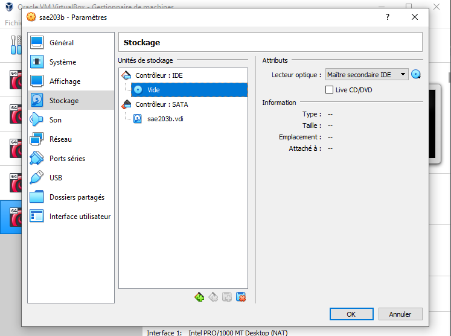
</div>

Cliquez sur le logo du disque bleu tout à droite puis sélectionnez le fichier S203_Debian11.viso
La machine virtuelle est maintenant prête à être lancée !
Vous aurez des téléchargements de ce type à son lancement, c’est normal c’est l’auto-installation.

<div class = "resize">
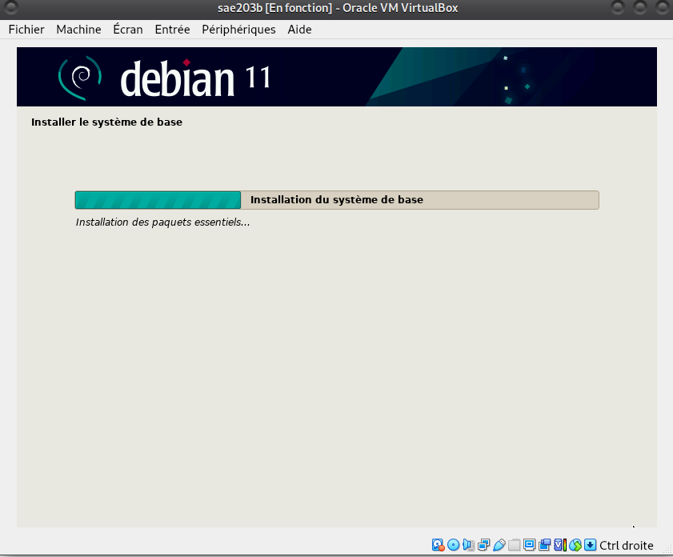
</div>

La machine est donc installée, les identifiants pour se connecter sont soir root (avec comme mot de passe root) ou sois user (avec comme mot de passe user). Mais on peut remarquer qu'il manque certaines choses assez pratiques, comme l’interface graphique qui n’est pas présente.

<div class = "resize">
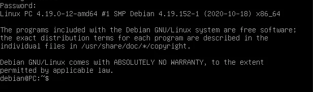
</div>

Comme vous pouvez le voir ce n’est pas très pratique d’avoir uniquement un fond noir pour faire ses propres commandes. C’est pourquoi nous allons ajouter quelques fonctionnalités dans l’auto-installation pour tout améliorer, nous aurons comme fonctionnalités :

* Ajouter les droits sudo a “user“ (ce qui correspond aux droits administrateurs),
* Installer l’environnement Mate afin d’avoir un vrai interface graphique,
* Installer quelques paquets comme git, bash-completion etc...

Pour ajouter tout cela, il faut aller dans le fichier “preseed-fr”, puis ajouter les valeurs écrites ci dessous :

* Ajouter ligne 56 : d-i passwd/user-default-groups string audio cdrom video sudo
* Ajouter ligne 83 : tasksel tasksel/first multiselect standard ssh-server mate-desktop d-i pkgsel/include string sudo git sqlite3 curl bash-completion neofetch

Nous allons ensuite commencer à s’occuper de l’installation du logiciel git, tout d’abord assurez vous de bien être connecté avec le compte “user”.

<div class = "resize">
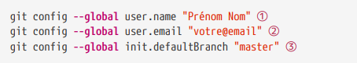
</div>

Évidemment il vous faut remplacer les informations entre guillemet par vos informations sauf pour “master” qui doit rester comme il est.

Ensuite nous allons installer un nouveau paquet, qui est le paquet git-gui. Il permet d’avoir une interface graphique pour le système de gestion de version git. Git permet de suivre l'évolution d'un projet en enregistrant des instantanés, appelés "commits", du code source à différents moments.
Pour installer ce paquet nous allons d’abord update le paquet nommé “apt” permettant d’installer d’autres paquets. Avec la commande suivante :

```
sudo apt update
```

Puis ensuite la commande suivante pour installer git-gui :

```
sudo apt install git-gui
```

## Quelle sera la ligne de commande git pour utiliser par défaut le proxy de l’université sur tous vos projets git ?

* Git Gui est l'interface graphique d'un outil en ligne de commande. De ce fait, toutes les possibilités offertes par Git ne sont pas disponibles dans Git Gui. Il se lance comme une application, dans un terminal et possède une interface graphique.

[Lien vers la source(guide)](http://codeur-pro.fr/git-gui-guide-complet/)

gitk peut être un outil d'apprentissage utile pour ceux qui découvrent le contrôle de version, ou ceux qui migrent depuis un autre système de contrôle de version comme Subversion. C'est un utilitaire pratique qui est fourni avec le noyau Git. Il fournit une interface utilisateur graphique qui aide à la visualisation de la mécanique interne de Git. Il se lance aussi de la même façon que Git Gui.

[Lien vers la source(tutorials gitk)](https://www.atlassian.com/fr/git/tutorials/gitk)

Voici les lignes de commande pour utiliser par défaut le proxy de l’université sur tous nos projets git :

```
git config --global http.proxy http://proxy.universite.fr:8080
git config --global https.proxy http://proxy.universite.fr:8080
```

Il nous reste ensuite à préparer tout ce qui est nécessaire pour rediriger les messages vers le port 3000.
Vous devez aller dans les paramètres de la machine virtuelle et dans la partie réseau cliquez sur “avancé” puis sur la redirection de ports et rentre les informations comme ci dessous.

<div class = "resize">
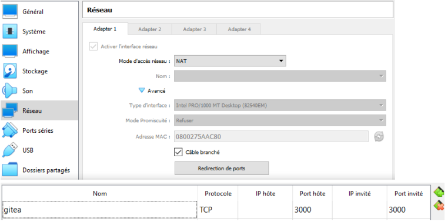
</div>

## Qu’est-ce que Gitea ?

Gitea est une solution d'hébergement de code léger gérée par la communauté écrite en Go. Il est publié sous licence MIT. Gitea est un service Git auto-hébergé indolore. Il est similaire à GitHub, Bitbucket et GitLab.

[Lien vers la source(doc gitea)](https://docs.gitea.io/en-us/)

## À quels logiciels bien connus dans ce domaine peut-on le comparer (en citer au moins 2) ?

Gitea est comparable avec Github ou même Gitlab qui sont assez connus.

Nous allons maintenant nous préoccuper de l’installation de gitea à l’aide de fichier binaire compilé (Qui sont des fichiers permettant l’installation).

La commande suivante permettra d’installer tout d’abord gitea en version 1.18.5 :

```
wget -O gitea https://dl.gitea.com/gitea/1.18.5/gitea-1.18.5-linux-amd64
chmod +x gitea
```

Gitea est donc normalement bien installé, on peut le vérifier avec cette commande :

```
systemctl status gitea.service
```

Si cette commande explique comment résoudre le problème dû au fait que ce n’est pas correctement installé, c’est que vous avez fait une erreur dans l’installation.

Ensuite dans la machine virtuelle, placez vous dans ce fichier grâce à “nano” :

```
/etc/systemd/system/gitea.service
```

Une fois dedans écrivez ces lignes de commandes :

```
[Unit]
Description=Gitea (Git with a cup of tea)
After=syslog.target
After=network.target

[Service]
RestartSec=2s
Type=simple
User=git
Group=git
WorkingDirectory=/var/lib/gitea/
ExecStart=/usr/local/bin/gitea web --config /etc/gitea/app.ini
Restart=always
Environment=USER=user HOME=/home/git GITEA_WORK_DIR=/var/lib/gitea

[Install]
WantedBy=multi-user.target
```

[Lien vers la source(gitea service)](https://github.com/go-gitea/gitea/blob/main/contrib/systemd/gitea.service)
[Lien vers la source(linux service)](https://docs.gitea.io/en-us/linux-service/)

Ensuite il nous faut activer gitea grâce aux commandes suivantes :

```
sudo systemctl enable gitea
sudo systemctl start gitea
```

Nous allons désormais faire en sorte que git se lance automatiquement à chaque démarrage de la machine virtuelle.
Ecrivez les commandes suivantes pour permettre le lancement automatique de gitea :

```
sudo systemctl deamon-reload
sudo systemctl enable gitea.service
```

Puis la commande suivante pour vérifier que tout fonctionne bien :

```
sudo systemctl start gitea.service
```

On peut donc se permettre d’aller sur l’url suivant depuis la machine virtuelle : ``http://localhost:3000``
Normalement, si toute les étapes ont été réalisées comme demandées vous devez arriver sur ce site :

<div class = "resize">
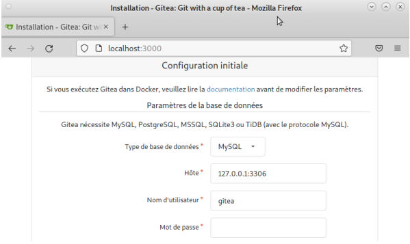
</div>

Le compte administrateur web sera :

* Nom : gitea

* Password : gitea

* Email : git@localhost

## Comment faire pour la mettre à jour sans devoir tout reconfigurer ? Essayez en mettant à jour vers la version 1.19

Pour installer la version 1.19 il faut tout d’abord stopper la version actuelle.

```
sudo systemctl stop gitea.service
```

Puis il faut installer la version 1.19 :

```
wget -O /tmp/gitea https://dl.gitea.io/gitea/1.19/gitea-1.19-linux-amd64
```

Il nous reste plus qu’à activer la dernière version installée :

```
sudo systemctl start gitea.service
```

Tout est maintenant parfait, vous pouvez utiliser gitea comme vous le souhaitez. Vous pouvez même faire l'ajout de différents projets pour vérifier que tout fonctionne bien.

# **Création machine virtuelle**

## Création de la machine virtuelle

Nous insérons les caractéristiques à respecter comme le nom de la nouvelle machine virtuelle sera `sae203`.

<div class = "resize">
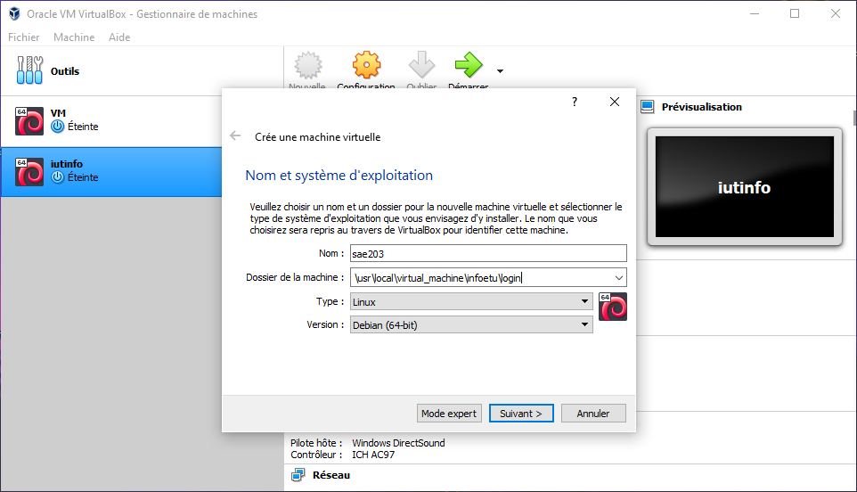
</div>

Elle sera installer dans le dossier `/usr/local/virtual_machine/infoetu/`**`login`** avec un système d’exploitation `Linux` sous `Debian (64-bit)`.

---

Une taille mémoire de **`2048 MB`**.
<div class = "resize">
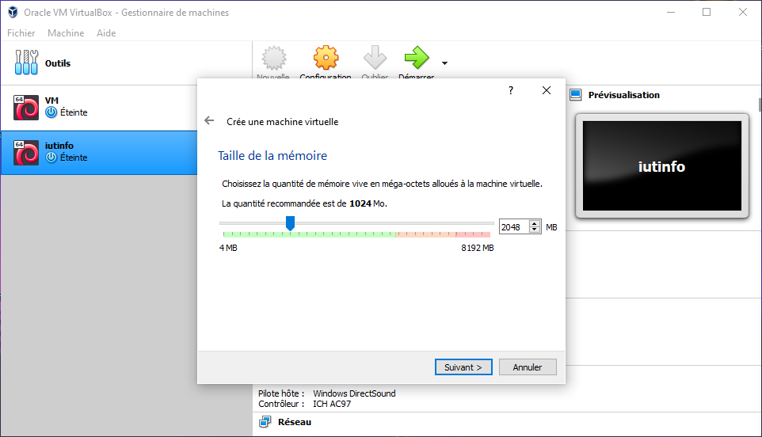
</div>

---

On définit la taille du disque dur sur **`20Go`**, et on laisse le reste **`par défaut`**.

<div class = "resize">
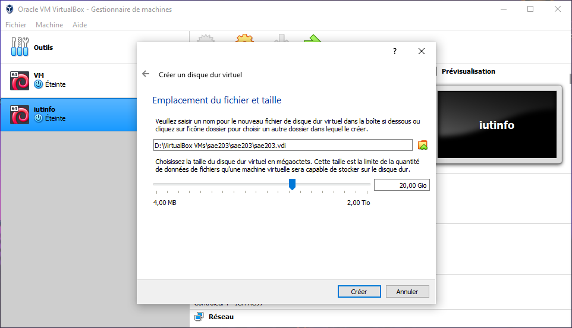
</div>

### Que signifie “64-bit” dans “Debian 64-bit” ?

> Debian 64 bit, le 64 signifie la longueur du registre mémoire que peut manipuler un processeur.

### Quelle est la configuration réseau utilisée par défaut ?

> La configuration réseau est NAT.

### Quel est le nom du fichier XML contenant la configuration de votre machine ?

PAS TROUVER.

## Installation de l’OS

Au lancement de la machine virtuelle, on va laisser tout **`par défaut`** sauf pour :

Le nom de la machine va s’appeler **`serveur`**.
<div class = "resize">
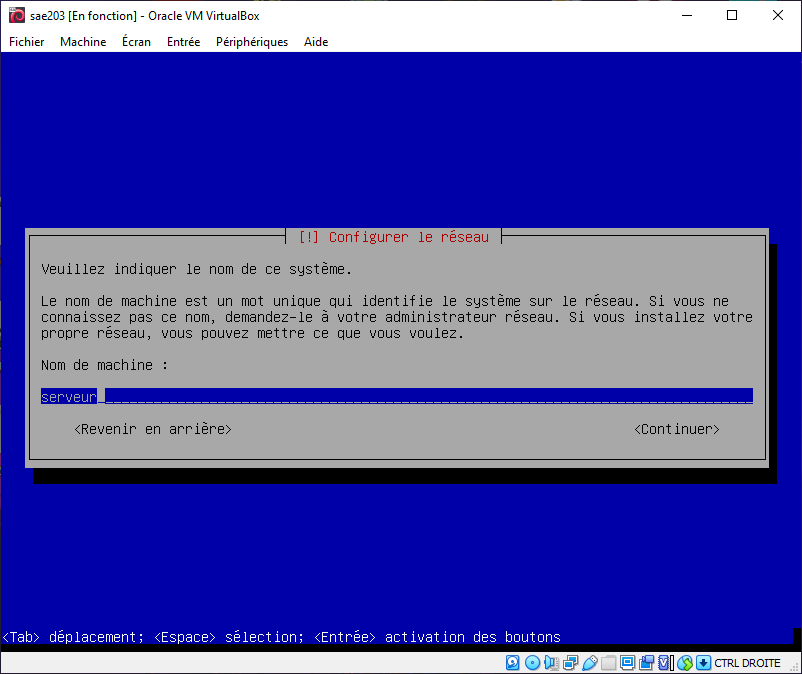
</div>

---

On choisi la langue **`Français`**.
<div class = "resize">
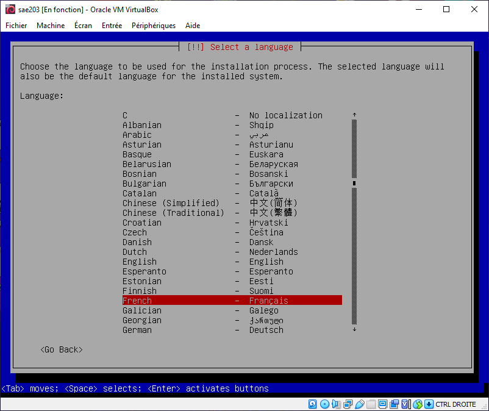
</div>

---

On va ensuite choisir le miroir : `http://debian.polytech-lille.fr`.
<div class = "resize">
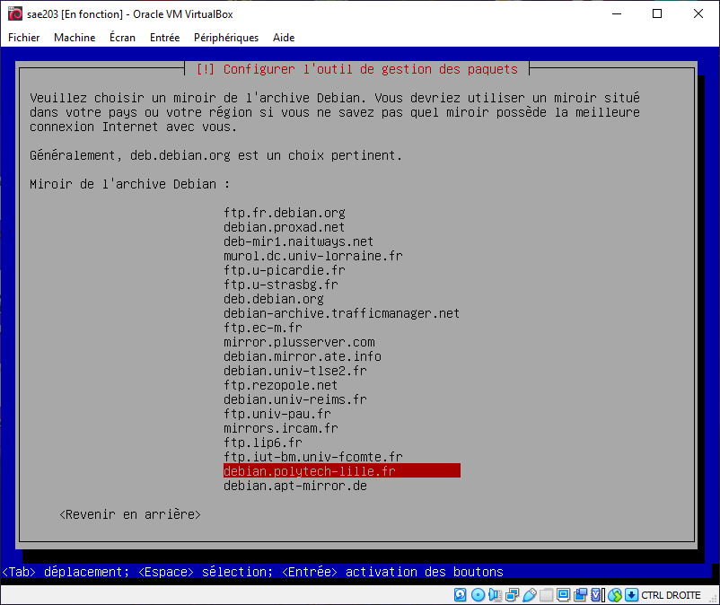
</div>

---

Le proxy utilisé sera `http://cache.univ-lille.fr:3128`.
<div class = "resize">
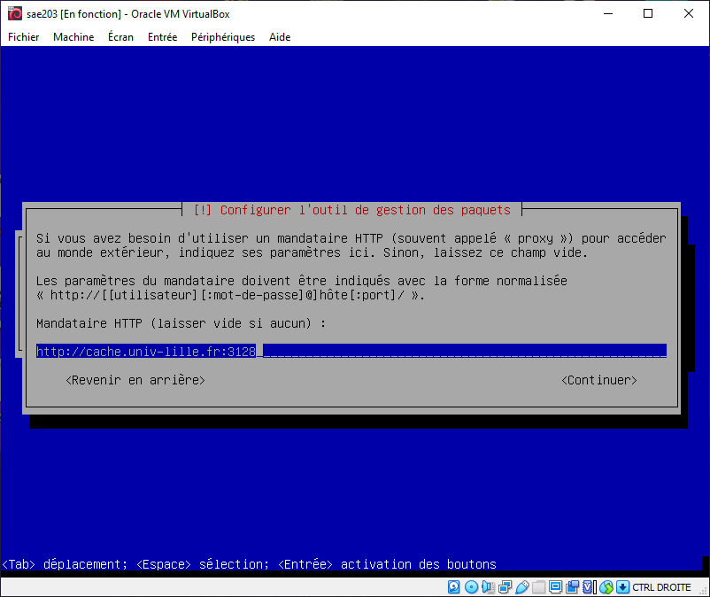
</div>

---

On donne le mot de passe ``root`` à l'utilisateur ``root``, puis on réécrit le même mot de passe pour confirmer.
<div class = "resize">
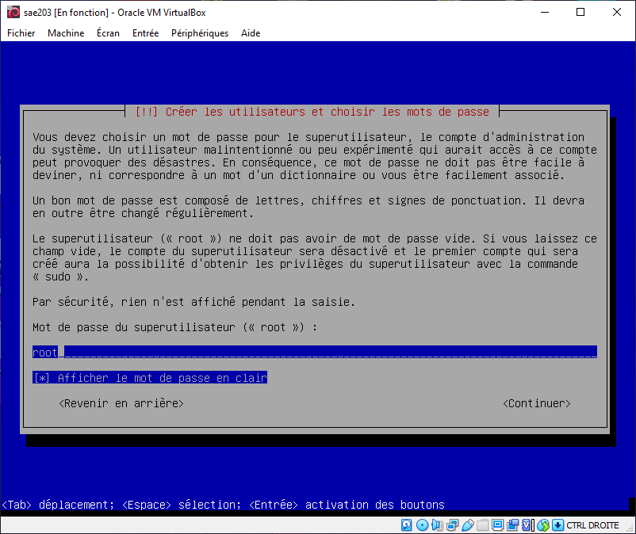
</div>

---

Le nouvel utilisateur se nommera ``User``.
<div class = "resize">
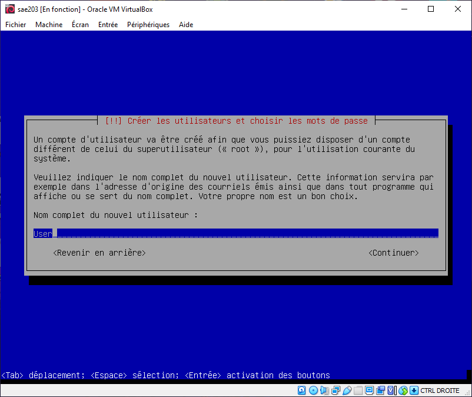
</div>

---

L’identifiant de cet utilisateur sera ``user``.
<div class = "resize">
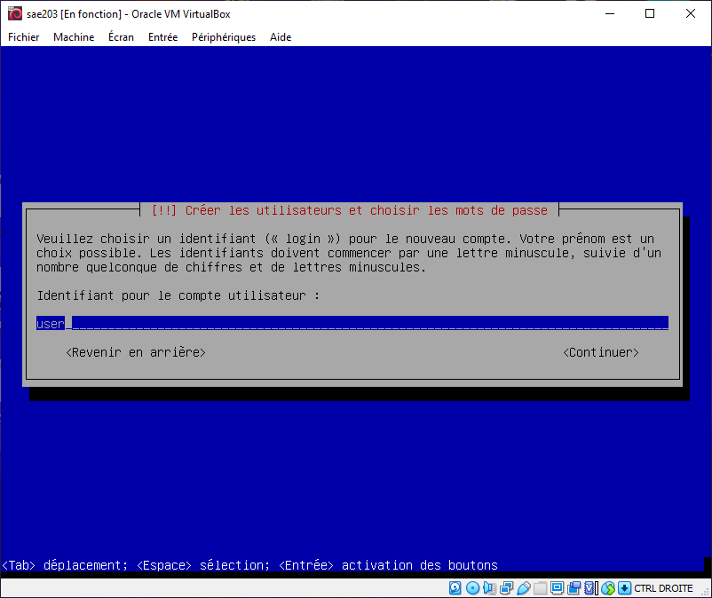
</div>

---

Il aura pour mot de passe ``user``, il faudra ensuite le réécrire pour confirmer.
<div class = "resize">
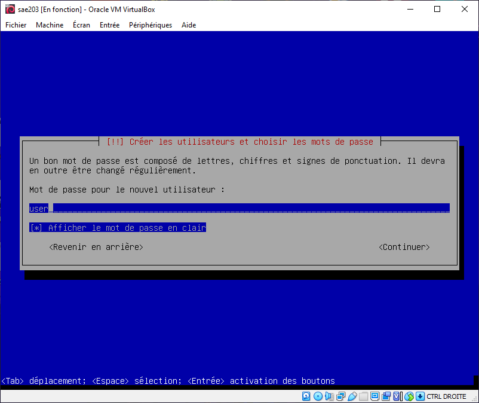
</div>

---

Dans les paquetages des logiciels à préinstaller il faut sélectionner uniquement ceux suivant :

* environnement de bureau Debian
* MATE
* serveur web
* serveur SSH
* utilitaire usuels du système

<div class = "resize">
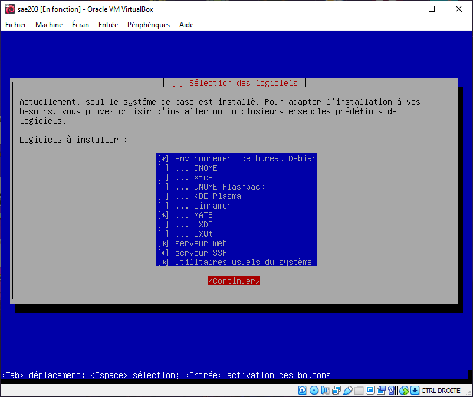
</div>

---

### Qu’est-ce qu’un fichier iso bootable ?

> Les ISO sont généralement utilisés pour fournir les fichiers d'installation de systèmes d'exploitation (Exemple : Windows ou Linux).

### Qu’est-ce que MATE ? GNOME ?

> MATE est un environnement de bureau attractif et intuitif en se basant sur les métaphores traditionnelles pour des systèmes d'exploitation similaires à Unix.

> GNOME est un acronyme de GNU Network Object Model Environment, c'est un environnement de bureau libre convivial qui a pour objectif est de rendre plus accessible l'utilisation du système d'exploitation GNU.

### Qu’est-ce qu’un serveur web ?

>Un serveur web est un ordinateur qui stocke les fichiers qui composent un site web, comme les documents HTML, les images, les feuilles du style CSS ou encore les fichiers JavaScript, afin de les envoyer à l'appareil de l'utilisateur qui visite le site.

### Qu’est-ce qu’un serveur ssh ?

> SSH signifie Secure Socket Shell, c'est un protocole réseau qui permet aux administrateurs d'accéder à distance à un ordinateur en toute sécurité.

### Qu’est-ce qu’un serveur mandataire ?

> Un serveur mandataire (soit serveur proxy en anglais), est un filtre qui permet de changer les règles d'accès à un réseau comme Internet, à cause des risques que peut représenter une connexion normale dans certains cas.

## Préparation du système

### Pour passer en mode console Il faut désormais effectuer la suite de touches suivantes

```
Ctrl + Alt + F1
```

### Une fois dans la console, il faut passer en mode sudo avec root en faisant

```
usermod -aG sudo user
```

### Comment peut-on savoir à quels groupes appartient l'utilisateur “user” ?

```
nano /etc/group | grep user
```

## Installation des suppléments invités

### On va donc devoir écrire les commandes suivantes pour mount le cd

```
sudo mount /dev/cdrom /mnt
```

### Nous allons ensuite installer les suppléments avec cette commande

```
sudo /mnt/VBoxLinuxAdditions.run
```

Une fois ceci tout est presque bon, il ne reste plus que le proxy à faire.

### Quelle est la version du noyau Linux utilisé par votre VM ? N’oubliez pas, comme pour toutes les questions, de justifier votre réponse

```
uname -r
```

cette commande donne la réponse suivante :

> 5.10.0-21-amd64

### À quoi servent les suppléments invités ? Donner 2 principales raisons de les installer

> A ceux que la taille de la fenêtre de la machine virtuelle s'adapte à la taille de l'écran de la machine courante.

### À quoi sert la commande mount (dans notre cas de figure et dans le cas général) ?

> La commande mount permet de monter une clé USB ou un disque dur, elle monte un système de fichiers indiqué comme répertoire à l'aide du paramètre.

## Précision sur le Proxy

Pour configurer le proxy on écrit tout simplement les commandes suivantes dans le terminal :

```
export http_proxy=http://cache.univ-lille.fr:3128
export https_proxy=$http_proxy
```

Ensuite on va aller écrire dans le $HOME/.bashrc une commande pour activer le proxy dès que l’on lance le terminal.

On écrit ceci :

```
export http_proxy=http://cache.univ-lille.fr:3128 export https_proxy=$http_proxy
```
